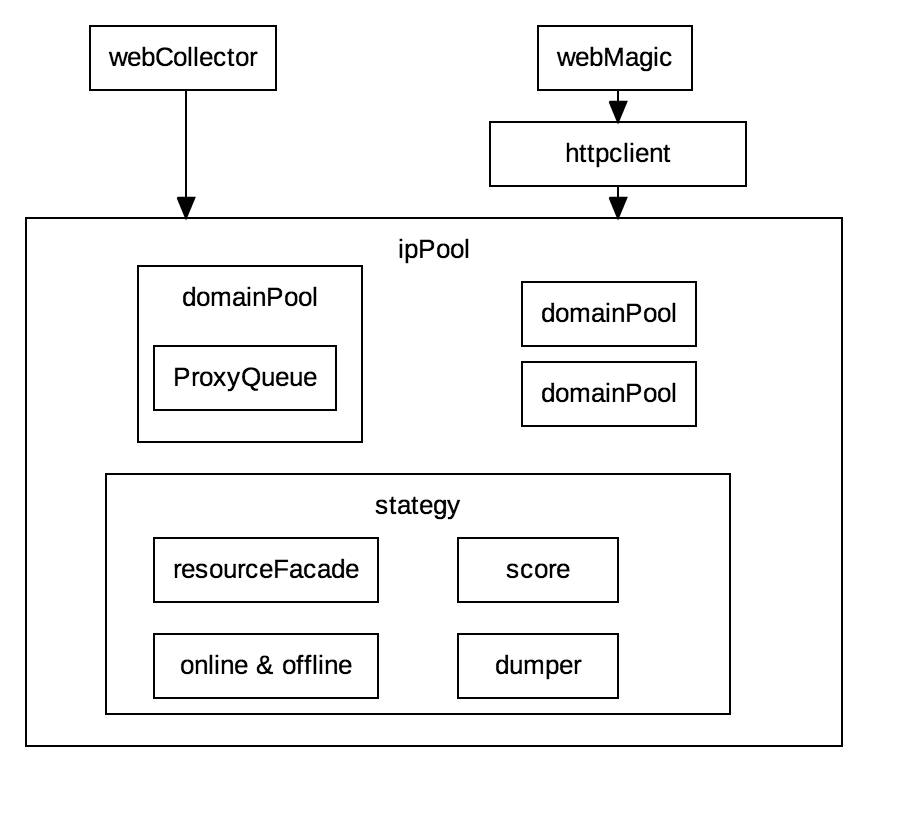
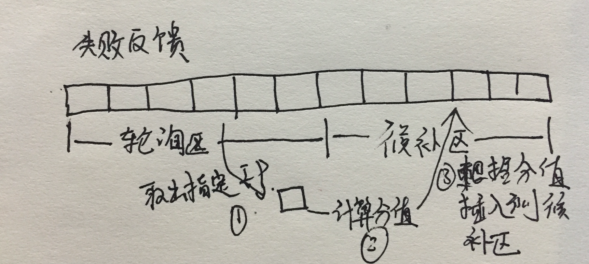

#client运行原理
这里讲述IP池的设计相关,如果您仅仅是为了使用dunproxy-client,则不必关心本文内容

client就是一个代理IP池的实现,IP池的设计基于两个点 1)代理IP都是不稳定的,不可靠的,需要一个机制来切换IP,尽可能使用高质量IP。2)IP和环境关系很大,同一个IP在不同的机器下访问不同的目标网站,其可用性表现都是不一样的

下面讲述client如何通过某种策略规避上面两个问题。

client结构如下图:


解决IP环境依赖问题的方式,那就是为每个目标维护一个资源池,所以就客户端结构来说,每个域名下的IP资源都是独立的。然后则是预校验机制,所以IP在加入到IPPool的时候,都需要进行可用性探测。这样保证IP在加入的时候,都是可用的

另一个问题,则是保证高质量IP被绑定到的概率更高。为了实现这个目的,我们设计了两个模型。
## IP容器模型,smartProxyQueue。``com.virjar.dungproxy.client.ippool.SmartProxyQueue``
smartProxyQueue是一个链表,用来实现IP轮训切换的队列,但是和一般的队列不同,他不是完全符合先进先出的规则的,而是一个高质量IP轮训,低质量候补的队列。这样,保证IP可以切换使用,且每次切换的IP都是较高质量的。
smartProxyQueue的结构如下:

队列分为轮询区域,候补区。他是在LinkedList上面的一个逻辑区域划分,使用一个ratio参数控制。轮询区域的资源没有分值优先级概念,每次使用IP从轮询区头部获取一个IP,并将其插入到轮询区的尾部。如果这些IP始终都没有失败,那么很完美,容器只会使用轮询区的IP。

获取一个IP的时候,流程如下

轮询区域的资源没有分值优先级概念,每次使用IP从轮询区头部获取一个IP,并将其插入到轮询区的尾部。

如果绑定的IP没有失败,则不进行队列位置调整

如果IP存在失败,那么进去失败候补流程,如下图:

不论此时IP在轮询区那个位置,都把他取出来,然后计算当前分值,根据分值插入到候补区的某个位置,候补区这是一个优先级区域了,分值高的资源将会存在候补区头部,约低越往后。
插入位置计算算法:
```
int index = (int) (proxies.size() * (ratio + (1 - ratio) * (1 - avProxy.getScore().getAvgScore())));
proxies.add(index, avProxy);
```
其中IP分值是一个0-1的小数。0表示分值最低,1表示分值最高。
所以如果分数为0,那么将会插入到候补区到尾部;如果分数为1,那么将会插入到候补区尾部


