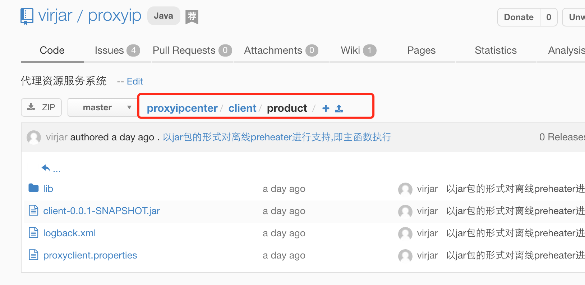
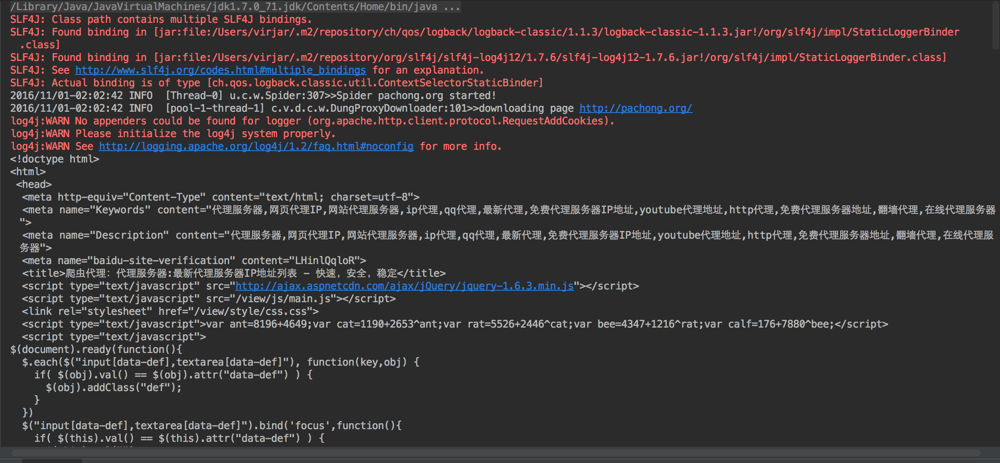

# 本文介绍如何快速的使用dungProxy的客户端(client)
#步骤列表
- 获取代码
- 添加依赖
- 配置参数
- 启动预热器
- 使用代理访问
- 使用webMagic

## 获取代码
项目仍是snapshot中,所以需要用户自己build代码.不过在client/product目录中存在一个编译好的client,包括他所依赖的jar包

如果是自己构建代码,则如下步骤
1. clone代码 ``git clone https://git.oschina.net/virjar/proxyipcenter.git``

```
bogon:temp virjar$ ls
bogon:temp virjar$ git clone https://git.oschina.net/virjar/proxyipcenter.git
Cloning into 'proxyipcenter'...
remote: Counting objects: 4809, done.
remote: Compressing objects: 100% (3638/3638), done.
remote: Total 4809 (delta 2410), reused 990 (delta 530)
Receiving objects: 100% (4809/4809), 11.59 MiB | 1.37 MiB/s, done.
Resolving deltas: 100% (2410/2410), done.
Checking connectivity... done.
bogon:temp virjar$ ls
proxyipcenter
bogon:temp virjar$ cd proxyipcenter/
bogon:proxyipcenter virjar$ ls
README.md		ddl_version1.1.sql	pom.xml			repeater
client			doc			proxyipcenter-dotnet	server
bogon:proxyipcenter virjar$ 
```
2. install 到本地maven库 ``mvn install -Dmaven.test.skip=true`

```
bogon:proxyipcenter virjar$ mvn install -Dmaven.test.skip=true
[INFO] Scanning for projects...
[WARNING] 
[WARNING] Some problems were encountered while building the effective model for com.virjar:client:jar:0.0.1-SNAPSHOT
[WARNING] 'build.plugins.plugin.version' for org.apache.maven.plugins:maven-compiler-plugin is missing. @ line 17, column 21
[WARNING] 
[WARNING] It is highly recommended to fix these problems because they threaten the stability of your build.
[WARNING] 
[WARNING] For this reason, future Maven versions might no longer support building such malformed projects.
[WARNING] 
.....
[INFO] 
[INFO] dungproxy ......................................... SUCCESS [0.502s]
[INFO] client ............................................ SUCCESS [4.103s]
[INFO] proxyipcenter-sever ............................... SUCCESS [9.467s]
[INFO] repeater .......................................... SUCCESS [0.476s]
[INFO] ------------------------------------------------------------------------
[INFO] BUILD SUCCESS
[INFO] ------------------------------------------------------------------------
[INFO] Total time: 14.757s
[INFO] Finished at: Tue Nov 01 01:11:40 CST 2016
[INFO] Final Memory: 42M/368M
[INFO] ------------------------------------------------------------------------
bogon:proxyipcenter virjar$ 
```

## 添加依赖


## 配置参数
配置参数是使用配置文件描述一些代理池需要的规则。如确定那些请求需要被代理等。在resouces目录添加文件``proxyclient.properties``

内容如下:
```
proxyclient.proxyDomainStrategy.whiteList=pachong.org,1212.ip138.com
proxyclient.preHeater.testList=http://pachong.org/
prxyclient.DefaultAvProxyDumper.dumpFileName=/tmp/proxyclient/availableProxy.json
```
这三个参数可以说使必须配置了。他们的含义如下:

|字段名称|含义|
|----|----|
|proxyclient.proxyDomainStrategy.whiteList|需要通过代理访问的网站,根据域名区分,子域名算不同域名。多个使用逗号分割|
|proxyclient.preHeater.testList|需要被预热器探测的URL,预热器可以根据这个URL清洗第一批可以使用的IP,请注意这个URL正常的响应应该是200(302也可以,但是302之后,需要是200,这里的200是指HTTP.OK,即http协议返回码为200)|
|prxyclient.DefaultAvProxyDumper.dumpFileName|临时文件,用于存放客户端运行时的可用IP数据,默认是:/tmp/proxyclient/availableProxy.json。windows上面的朋友要特别注意修改这个配置,否则不能正常的断点使用IP资源池,预热器也不能正常工作|

## 启动预热器
启动预热器的目的是离线的计算可用IP资源,为你的本地环境计算IP。这样能够尽力保证你本地的IP库是可用的。当然这个步骤只有第一次启动前需要做,也建议第一次访问某个网站的时候执行这一步.
预热器启动方式有两种
1. 通过代码


```
import com.virjar.dungproxy.client.ippool.PreHeater;

/**
 * Created by virjar on 16/11/1.
 */
public class Main {
    public static void main(String[] args) {
        PreHeater.start();
    }
}
```

2. 通过java命令
在product目录中,执行 ``java -jar client-0.0.1-SNAPSHOT.jar ``

等待程序执行结束(如果执行过,今后就不必再次执行了)

## 使用代理访问
api默认封装了一个叫做HttpInvoker的东西,他的内部就是用了代理池
```
import java.io.IOException;
import java.nio.charset.Charset;

import com.virjar.dungproxy.client.httpclient.HttpInvoker;
import com.virjar.dungproxy.client.ippool.IpPool;

/**
 * Created by virjar on 16/11/1.
 */
public class Main {
    public static void main(String[] args) throws IOException {
        for (int i = 0; i < 15; i++) {
            try {
                System.out.println(HttpInvoker.get("http://1212.ip138.com/ic.asp", Charset.forName("gb2312")));
            } catch (IOException e) {
                // e.printStackTrace();
            }
        }
        IpPool.getInstance().destroy();
    }
}
```


## 使用webMagic
###添加webMagic依赖

###添加如下代码 注意我们修改 ``new DungProxyDownloader()``,也即重写了downLoader
```
import java.io.IOException;

import com.virjar.dungproxy.client.webmagic.DungProxyDownloader;

import us.codecraft.webmagic.Page;
import us.codecraft.webmagic.Site;
import us.codecraft.webmagic.Spider;
import us.codecraft.webmagic.processor.PageProcessor;

/**
 * Created by virjar on 16/11/1.
 */
public class Main implements PageProcessor {
    Site site = Site.me();

    public static void main(String[] args) throws IOException {
        Spider.create(new Main())
                .setDownloader(new DungProxyDownloader())
                .thread(5)
                .addUrl("http://pachong.org/")
                .start();
    }

    @Override
    public void process(Page page) {
        System.out.println(page.getHtml());
    }

    @Override
    public Site getSite() {
        return site;
    }
}
```
###效果如下
